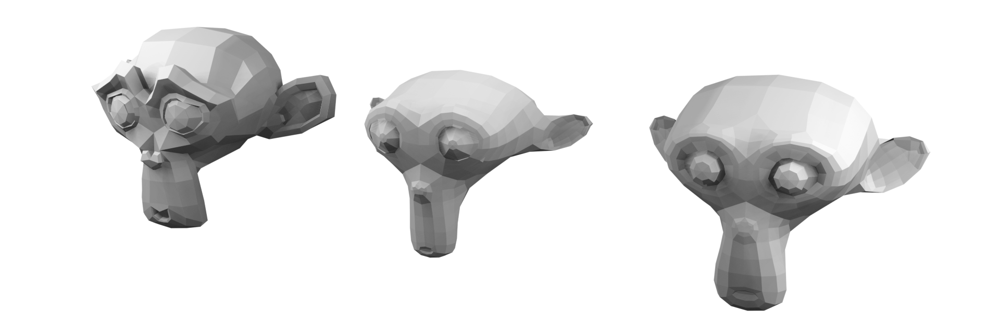

# MfxVTK

*An [Open Mesh Effect][OpenMeshEffect] plugin for [VTK][VTK] filters*



MfxVTK is a plugin that brings filters from the [Visualization Toolkit][VTK] (VTK) library
into any 3D software that supports the [Open Mesh Effect][OpenMeshEffect] standard.
It provides a non-destructive workflow for polygonal meshes, wireframes and point clouds.

To learn more, please have a look at [MfxVTK documentation][MfxVTKdocs].

🚧 *Currently this is a proof-of-concept; it works, but more features and polish
should come in the future.*

### Features

- Surface/volume point sampling
- Creating tetrahedral wireframe from points
- Smooth and Decimate effects
- ...and more, see [list of all effects][MfxVTKeffects].

### How to use it

In the [OpenMeshEffectForBlender branch of Blender][OpenMeshEffectForBlender]:

- select your mesh
- open the **Modifier** tab and select **Open Mesh Effect** modifier
- in modifier properties, set path to MfxVTK plugin (`mfx_vtk_plugin.ofx` – download
  [MfxVTK release] from GitHub or build it yourself)
- select desired effect from the drop-down menu

### How to build it yourself

You will need [Git], [CMake] and a C++ compiler toolchain (like Microsoft Visual Studio or GCC/Make).

First, build VTK (version >= 9.0), see [instructions on VTK wiki][BuildingVTK].

- Use `BUILD_SHARED_LIBS=OFF` to make your MfxVTK binary not depend on VTK shared libraries.
- Turn off `VTK_GROUP_ENABLE_Rendering`, `VTK_GROUP_ENABLE_Web`, `VTK_GROUP_ENABLE_MPI`,
 `VTK_GROUP_ENABLE_QT` to make compilation faster.
- (Optional) Use `VTK_SMP_IMPLEMENTATION_TYPE` other than `Sequential` for better performance of
 some filters.

Then clone MfxVTK from GitHub (note that it has the OpenMeshEffect repository as a submodule):

```sh
git clone --recurse-submodules https://github.com/tkarabela/MfxVTK
``` 

Build MfxVTK using CMake:

```sh
cd MfxVTK
mkdir cmake-build
cd cmake-build
cmake .. -DVTK_DIR:PATH=/path/to/VTK-9.0.1-build  # change this accordingly
cmake --build . --config Debug
```

The plugin is now in your build directory: `src/mfx_vtk_plugin/libmfx_vtk_plugin.ofx`.

### How it works

It converts Open Mesh Effect mesh into `vtkPolyData`. General structure
of the plugin as well as handy C++ wrapper over the Open Mesh Effect interface
is borrowed from [MfxVCG].

### License

MfxVTK source code (`src/mfx_vtk_plugin`) is released under the MIT license, see [LICENSE.txt](LICENSE.txt).
Parts of this repository also contain code licensed under the Apache 2 license, please
see copyright notices in individual files.

    MfxVTK Open Mesh Effect plug-in
    Copyright (c) 2020 Tomas Karabela
    
    Permission is hereby granted, free of charge, to any person obtaining a copy
    of this software and associated documentation files (the "Software"), to deal
    in the Software without restriction, including without limitation the rights
    to use, copy, modify, merge, publish, distribute, sublicense, and/or sell
    copies of the Software, and to permit persons to whom the Software is
    furnished to do so, subject to the following conditions:
    
    The above copyright notice and this permission notice shall be included in
    all copies or substantial portions of the Software.
    
    THE SOFTWARE IS PROVIDED "AS IS", WITHOUT WARRANTY OF ANY KIND, EXPRESS OR
    IMPLIED, INCLUDING BUT NOT LIMITED TO THE WARRANTIES OF MERCHANTABILITY,
    FITNESS FOR A PARTICULAR PURPOSE AND NONINFRINGEMENT. IN NO EVENT SHALL THE
    AUTHORS OR COPYRIGHT HOLDERS BE LIABLE FOR ANY CLAIM, DAMAGES OR OTHER
    LIABILITY, WHETHER IN AN ACTION OF CONTRACT, TORT OR OTHERWISE, ARISING FROM,
    OUT OF OR IN CONNECTION WITH THE SOFTWARE OR THE USE OR OTHER DEALINGS IN
    THE SOFTWARE.

[OpenMeshEffect]: http://openmesheffect.org
[OpenMeshEffectForBlender]: https://github.com/eliemichel/OpenMeshEffectForBlender
[VTK]: https://vtk.org
[MfxVTKdocs]: https://mfxvtk.readthedocs.io
[MfxVTKeffects]: https://mfxvtk.readthedocs.io/en/latest/list-of-effects.html
[MfxVCG]: https://github.com/eliemichel/MfxVCG
[BuildingVTK]: https://vtk.org/Wiki/VTK/Configure_and_Build
[MfxVTK release]: https://github.com/tkarabela/MfxVTK/releases
[CMake]: https://cmake.org
[Git]: https://git-scm.com

[vtkSmoothPolyDataFilter]: https://vtk.org/doc/nightly/html/classvtkSmoothPolyDataFilter.html
[vtkWindowedSincPolyDataFilter]: https://vtk.org/doc/nightly/html/classvtkWindowedSincPolyDataFilter.html
[vtkPolyDataPointSampler]: https://vtk.org/doc/nightly/html/classvtkPolyDataPointSampler.html
[vtkFeatureEdges]: https://vtk.org/doc/nightly/html/classvtkFeatureEdges.html
[vtkFillHolesFilter]: https://vtk.org/doc/nightly/html/classvtkFillHolesFilter.html
[vtkTubeFilter]: https://vtk.org/doc/nightly/html/classvtkTubeFilter.html
[vtkDecimatePro]: https://vtk.org/doc/nightly/html/classvtkDecimatePro.html
